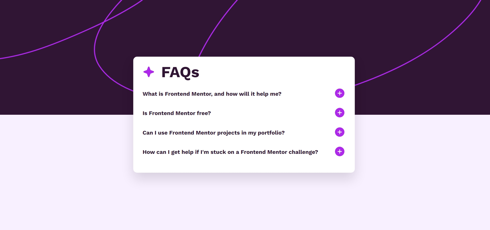

# Frontend Mentor - FAQ accordion solution

This is a solution to the [FAQ accordion challenge on Frontend Mentor](https://www.frontendmentor.io/challenges/faq-accordion-wyfFdeBwBz).

## Table of contents

- [Overview](#overview)
  - [The challenge](#the-challenge)
  - [Screenshot](#screenshot)
  - [Links](#links)
- [My process](#my-process)
  - [Built with](#built-with)
  - [What I learned](#what-i-learned)
  - [Continued development](#continued-development)

## Overview

### The challenge

Users should be able to:

- Hide/Show the answer to a question when the question is clicked
- Navigate the questions and hide/show answers using keyboard navigation alone
- View the optimal layout for the interface depending on their device's screen size
- See hover and focus states for all interactive elements on the page

### Screenshot



### Links

- Solution URL: [Add solution URL here](https://your-solution-url.com)
- Live Site URL: [Add live site URL here](https://your-live-site-url.com)

## My process

### Built with

- Semantic HTML5 markup
- CSS custom properties
- Flexbox
- JavaScript DOM Manipulation

### What I learned

- DOM Manipulation using JavaScript
- Change of height according to the expansion of answer box
- Application of hide/show effect on answer on clicking the question or icon
- This challenge has boosted my confidence in using JavaScript to add functionalities in my website.

This is my solution to hide/show effect.

```html
<div class="faq-question">
  <a href="#" class="question"> Is Frontend Mentor free?</a>
  <a class="plus-icon" href="#"
    ></a>
</div>
```

```js
questions.forEach((question) => {
  question.addEventListener("click", function () {
    const icon = question.querySelector(".plus-icon");
    const answer = this.nextElementSibling;
    if (answer.style.display === "block") {
      icon.innerHTML =
        icon.innerHTML = ``;
      answer.style.display = "none";
    } else {
      answer.style.display = "block";
      icon.innerHTML = ``;
    }
  });
});
```

### Continued development

- I'll focus on adding responsiveness to the layouts and integration of JavaScript to add key functionalities.
